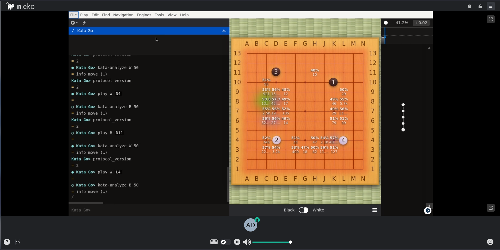
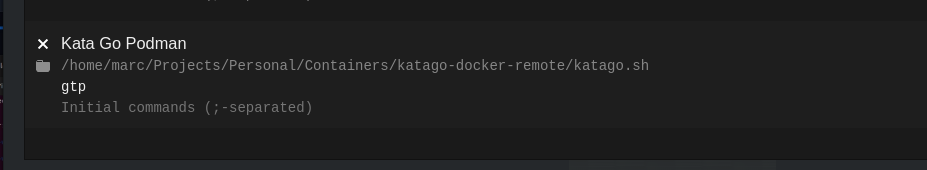

# KataGo Docker

This guide is meant to run KataGo with TensorRT in a container.

It may also work with other version of KataGo (OpenCL, CUDA, Eigen), but you will have to edit the Dockerfile.

## Build KataGo in a Docker container

1. Clone the repository.

2. Build the docker image or use `darkness4/katago:latest` :

   ```sh
   docker build -t katago:tensorrt .
   ```

You can customize the Dockerfile by setting `--build-arg` parameters like `CUDA_VERSION`, `OS_VERSION` and `TRT_VERSION`. Note that `TRT_VERSION` must be available in the container.

## Run KataGo in Docker

1. Install Docker and the [NVIDIA Container Toolkit](https://docs.nvidia.com/datacenter/cloud-native/container-toolkit/latest/install-guide.html).

2. Create an executable shell script to run KataGo:

   ```sh
   #!/bin/sh
   # katago.sh

   set -e

   SCRIPTPATH="$(dirname "$(realpath "$0")")"

   # Change this if you want to use an another model, see https://katagotraining.org
   RELEASE=kata1-b18c384nbt-s7192213760-d3579182099

   if [ ! -f "$SCRIPTPATH/default_model.bin.gz" ]; then
      curl -fsSL https://media.katagotraining.org/uploaded/networks/models/kata1/$RELEASE.bin.gz -o "$SCRIPTPATH/default_model.bin.gz"
   fi

   docker run --rm --gpus all -it \
     -v "$SCRIPTPATH/default_gtp.cfg:/app/default_gtp.cfg:ro" \
     -v "$SCRIPTPATH/default_model.bin.gz:/app/default_model.bin.gz" \
     katago:tensorrt \
     $@

   ```

3. Use `katago.sh` as the main entrypoint.

   ```sh
   chmod +x katago.sh
   ./katago.sh gtp
   # KataGo v1.13.2
   # Using TrompTaylor rules initially, unless GTP/GUI overrides this
   # Initializing board with boardXSize 19 boardYSize 19
   # Loaded config /app/default_gtp.cfg
   # Loaded model /app/default_model.bin.gz
   # Model name: kata1-b18c384nbt-s5832081920-d3223508649
   # GTP ready, beginning main protocol loop
   ```

## Run KataGo remotely with Docker and SSH

**On the remote machine:**

1. Install the SSH server and [push your public SSH key to your user authorized_keys file](https://www.ssh.com/academy/ssh/copy-id). The authentication must not use a password.

2. Install Docker and the [NVIDIA Container Toolkit](https://docs.nvidia.com/datacenter/cloud-native/container-toolkit/latest/install-guide.html).

**On your local machine:**

1. Prepare the `default_gtp.cfg`.

2. Alongside the `default_gtp.cfg`, create an executable shell script to run KataGo:

   ```sh
   #!/bin/sh
   # katago-remote.sh

   set -e

   SCRIPTPATH="$(dirname "$(realpath "$0")")"

   # Change this if you want to use an another model, see https://katagotraining.org
   RELEASE=kata1-b18c384nbt-s7192213760-d3579182099

   scp "$SCRIPTPATH/default_gtp.cfg" remote-user@remote-machine:/tmp/default_gtp.cfg

   ssh remote-user@remote-machine "set -e
   if [ ! -f /tmp/default_model.bin.gz ]; then
      curl -fsSL https://media.katagotraining.org/uploaded/networks/models/kata1/$RELEASE.bin.gz -o /tmp/default_model.bin.gz
   fi

   docker run --rm -it \
     --gpus all \
     -v /tmp/default_gtp.cfg:/app/default_gtp.cfg:ro \
     -v /tmp/default_model.bin.gz:/app/default_model.bin.gz:ro \
     docker.io/darkness4/katago:latest \
     $@"

   ```

   Edit the script to match your configuration (ssh parameters, etc.).

3. Make it executable and test it.

   ```sh
   chmod +x katago-remote.sh
   ./katago-remote.sh gtp
   # KataGo v1.13.2
   # Using TrompTaylor rules initially, unless GTP/GUI overrides this
   # Initializing board with boardXSize 19 boardYSize 19
   # Loaded config /app/default_gtp.cfg
   # Loaded model /app/default_model.bin.gz
   # Model name: kata1-b18c384nbt-s5832081920-d3223508649
   # GTP ready, beginning main protocol loop
   ```

## Run KataGo remotely with Enroot and SSH

**On the remote machine:**

1. Install the SSH server and [push your public SSH key to your user authorized_keys file](https://www.ssh.com/academy/ssh/copy-id). The authentication must not use a password.

2. Install Enroot and the [NVIDIA Container Toolkit](https://docs.nvidia.com/datacenter/cloud-native/container-toolkit/latest/install-guide.html).

**On your local machine:**

1. Prepare the `default_gtp.cfg`.

2. Alongside the `default_gtp.cfg`, create an executable shell script to run KataGo with Enroot:

   ```sh
   #!/bin/sh
   # katago-remote.sh

   set -e

   SCRIPTPATH="$(dirname "$(realpath "$0")")"

   # Change this if you want to use an another model, see https://katagotraining.org
   RELEASE=kata1-b18c384nbt-s7192213760-d3579182099

   # Copy config file to remote server
   scp "$SCRIPTPATH/default_gtp.cfg" remote-user@remote-machine:/tmp/default_gtp.cfg

   ssh remote-user@remote-machine "set -e
   rm -f /tmp/katago.sqsh
   enroot remove -f -- katago || true
   enroot import -o /tmp/katago.sqsh -- docker://registry-1.docker.io#darkness4/katago:latest
   enroot create -n katago -- /tmp/katago.sqsh
   if [ ! -f /tmp/default_model.bin.gz ]; then
   curl -fsSL https://media.katagotraining.org/uploaded/networks/models/kata1/$RELEASE.bin.gz -o /tmp/default_model.bin.gz
   fi

   enroot start  \
   --mount /tmp/default_gtp.cfg:/app/default_gtp.cfg:ro,x-create=file,bind \
   --mount /tmp/default_model.bin.gz:/app/default_model.bin.gz:ro,x-create=file,bind \
   katago \
   $@"

   ```

   Edit the script to match your configuration (ssh parameters, etc.).

3. Make it executable and test it.

   ```sh
   chmod +x katago-remote.sh
   ./katago-remote.sh gtp
   # KataGo v1.13.2
   # Using TrompTaylor rules initially, unless GTP/GUI overrides this
   # Initializing board with boardXSize 19 boardYSize 19
   # Loaded config /app/default_gtp.cfg
   # Loaded model /app/default_model.bin.gz
   # Model name: kata1-b18c384nbt-s5832081920-d3223508649
   # GTP ready, beginning main protocol loop
   ```

## Running on DeepSquare

DeepSquare is a decentralized HPC as a service. You can read more about it on [DeepSquare's official website](https://deepsquare.io) and try the [portal](https://app.deepsquare.run).



### How to use with Neko

Install the [`dps`](https://docs.deepsquare.run/workflow/cli/getting-started), [the DeepSquare CLI](https://docs.deepsquare.run/workflow/cli/getting-started).

Using with [Neko](https://neko.m1k1o.net/#/) is the easiest way to use Sabaki and Katago.

Just submit the job:

```shell
dps submit -w -e --no-ts --job-name katago --credits 10000 ./job.katago.yaml
```

A bore URL will appear in the logs, just connect to it (credentials: user: `admin` and pass: `neko`).

You can start the engine by opening the Engines Sidebar (Engines > Show Engines Sidebar).


Then, you can toggle the Analysis mode with <kbd>F4</kbd>.

### How to use with SSH

1. Edit the job, and replace the SSH public key.

2. You need to start Sabaki locally.

3. Then, you can submit the job:

   ```shell
   dps submit -w -e --no-ts --job-name katago --credits 10000 ./job.yaml
   ```

   The user ID and bore URL will appear. This is the URL to the SSH server. You need to use the TCP one.

4. Write a script on your computer to connect to the server via SSH and launch katago with Sabaki:

   **/projects/katago/script**

   ```shell
   #!/bin/sh
   set -e

   SCRIPTPATH="$(dirname "$(realpath "$0")")"

   # Copy config file to remote server
   scp -P <port> "$SCRIPTPATH/default_gtp.cfg" <user>@bore.deepsquare.run:/tmp/default_gtp.cfg

   ssh -p <port> <user>@bore.deepsquare.run "set -e

   # Change this if you want to use an another model, see https://katagotraining.org
   RELEASE=kata1-b18c384nbt-s8493331456-d3920571699

   if [ ! -f \$DEEPSQUARE_DISK_TMP/default_model.bin.gz ]; then
     curl -fsSL https://media.katagotraining.org/uploaded/networks/models/kata1/\$RELEASE.bin.gz -o \$DEEPSQUARE_DISK_TMP/default_model.bin.gz
   fi

   /app/katago $@ -model \$DEEPSQUARE_DISK_TMP/default_model.bin.gz -config /tmp/default_gtp.cfg"

   ```

   Replace `<user>` and `<port>` with the user ID and bore port.

5. Add an Engine from the Engines Sidebar (Engines > Show Engines Sidebar) with:

   Path: The path to the script (`/projects/katago/script`)

   Arguments: `gtp`

   

6. Then start the engine:

   

7. Finally, you can toggle the Analysis mode with <kbd>F4</kbd>.
